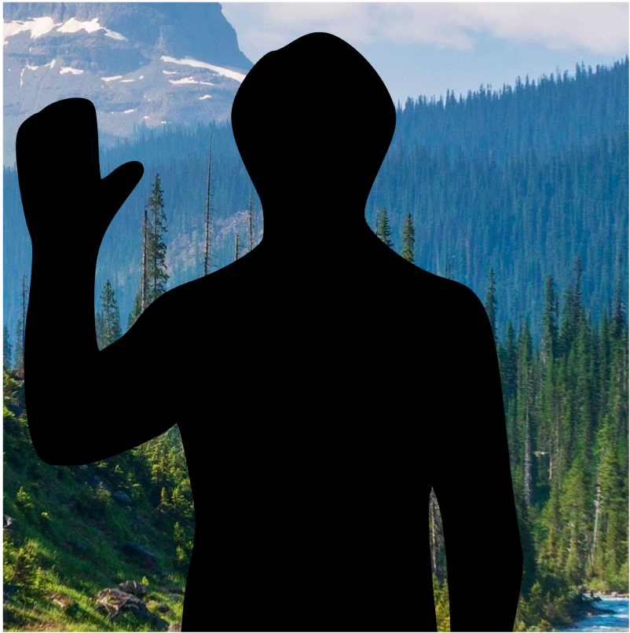
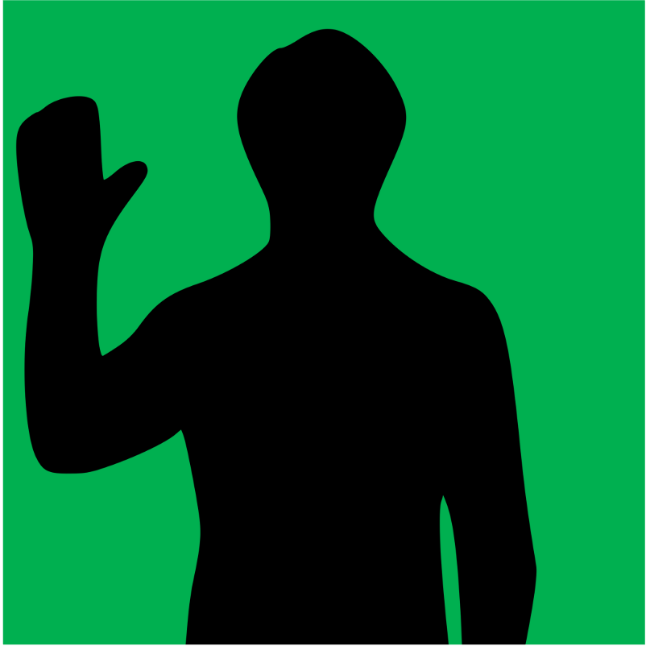
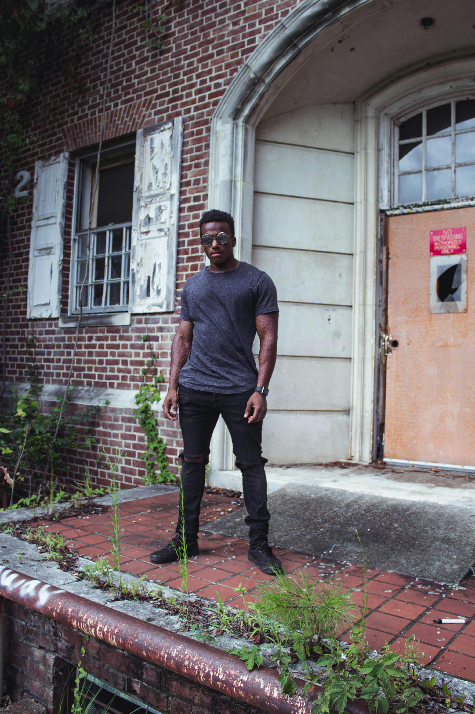
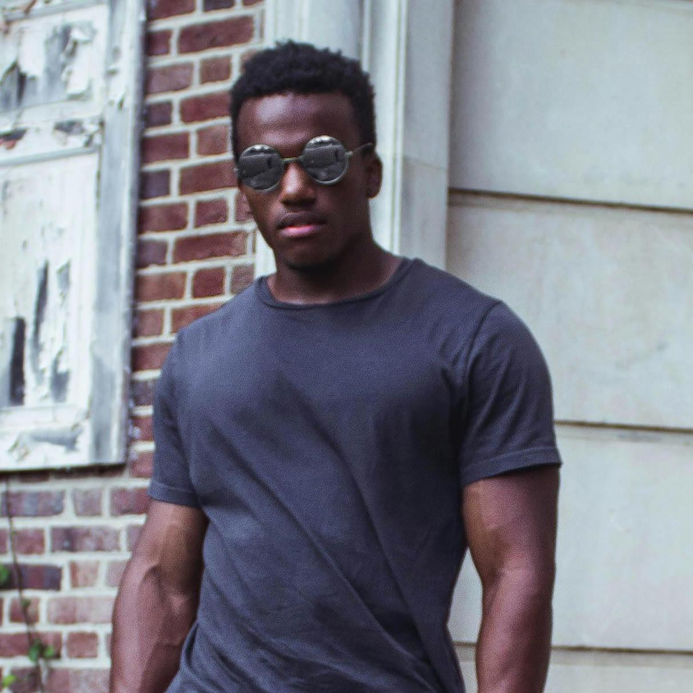
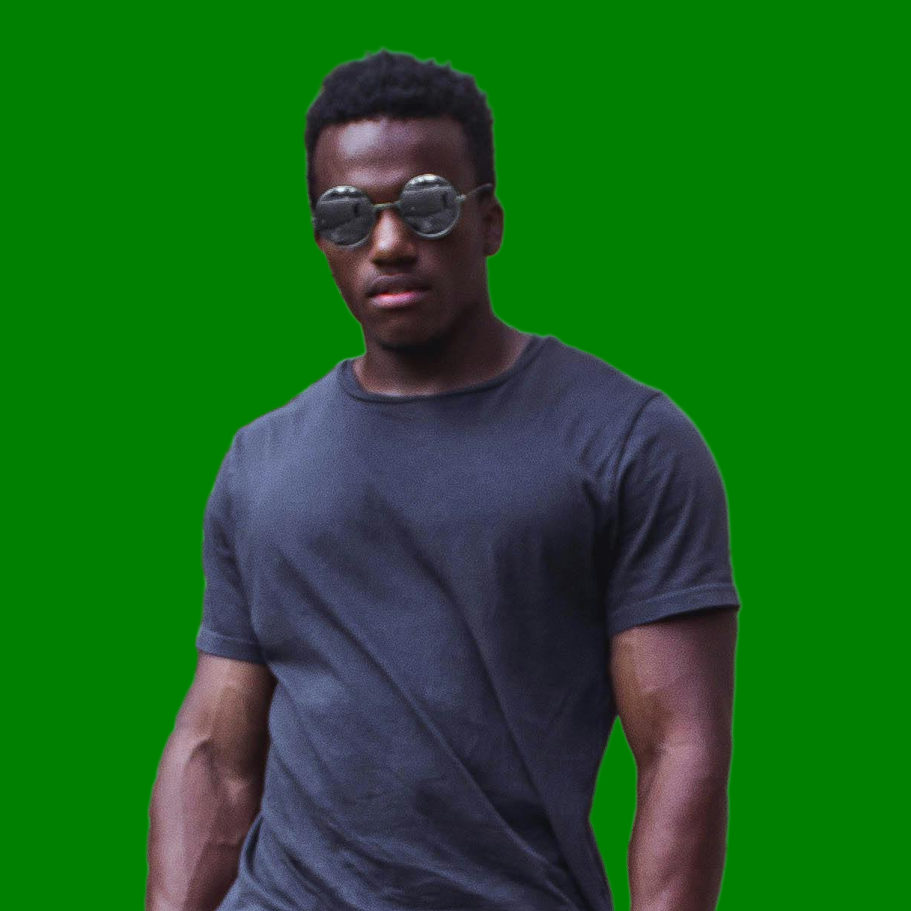
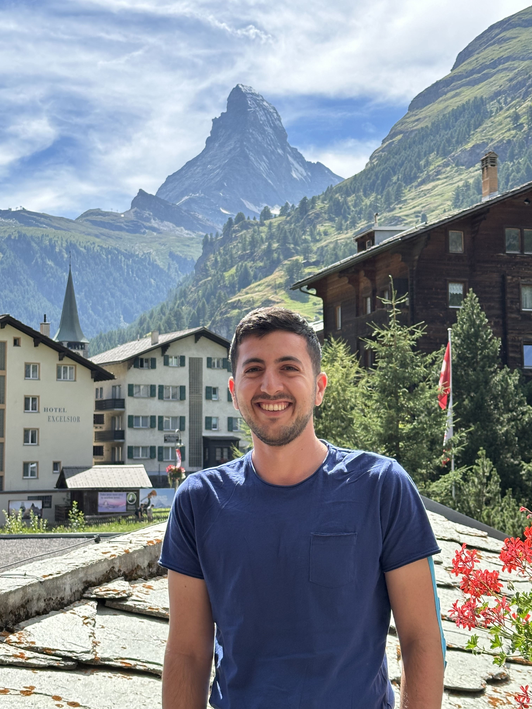
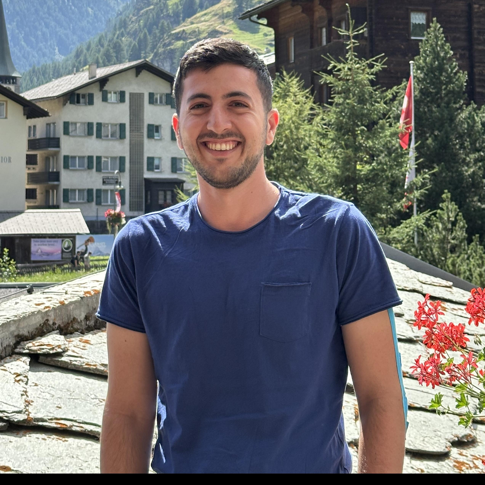
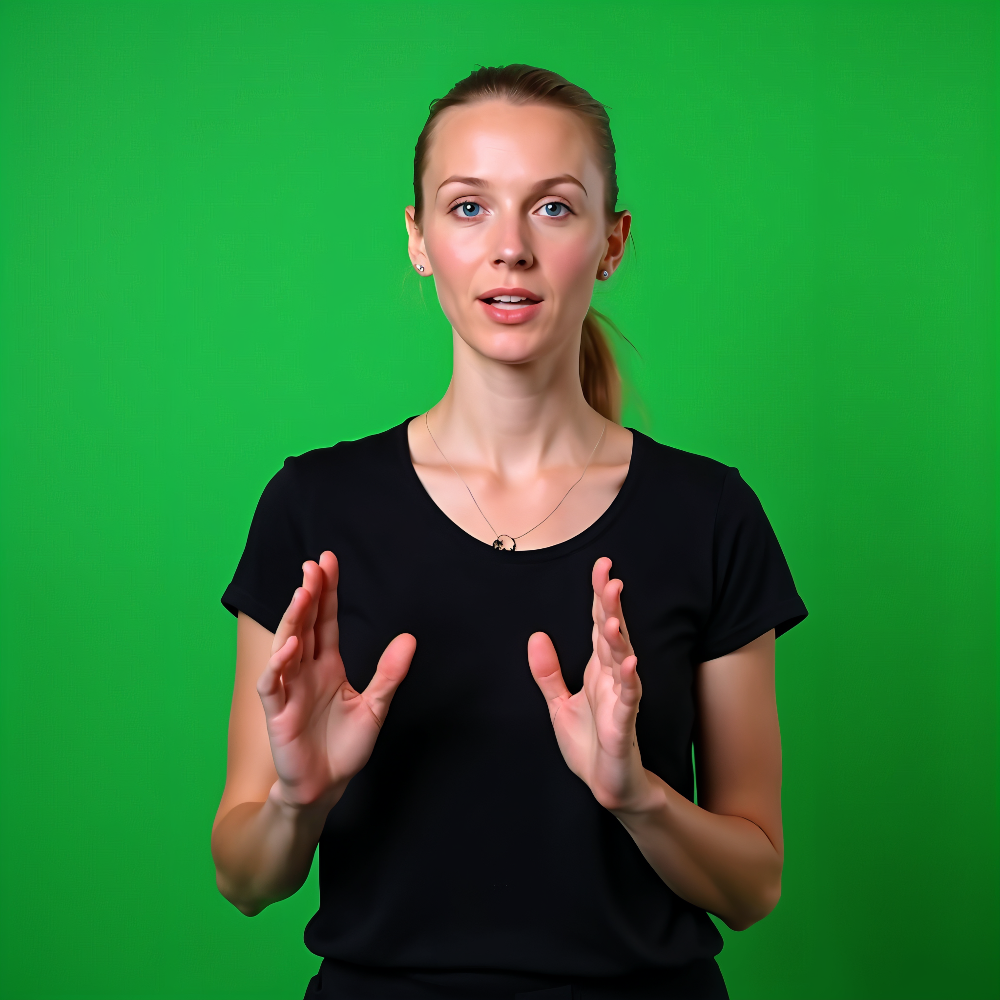
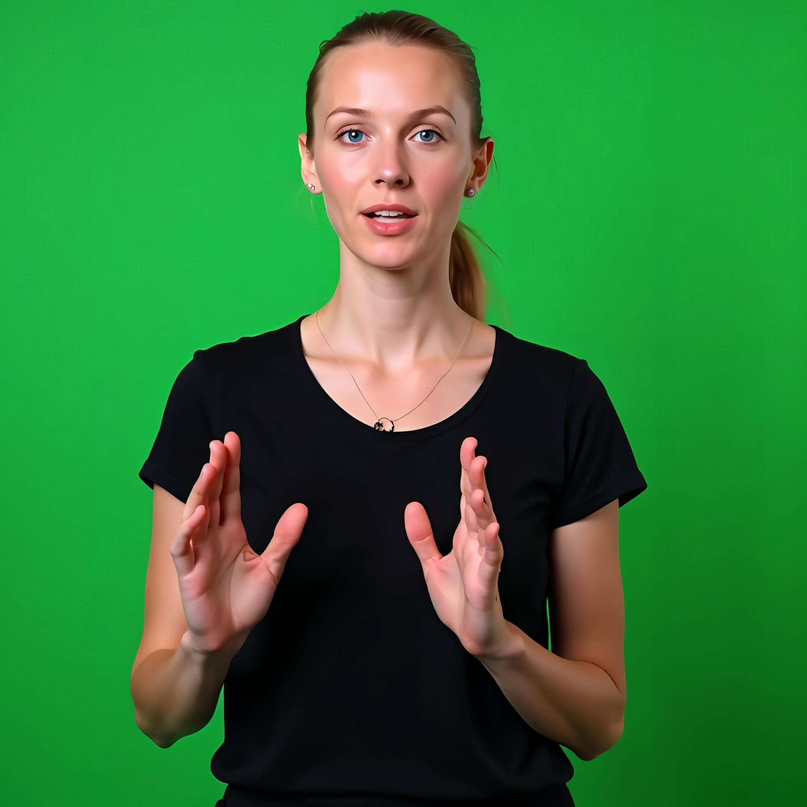
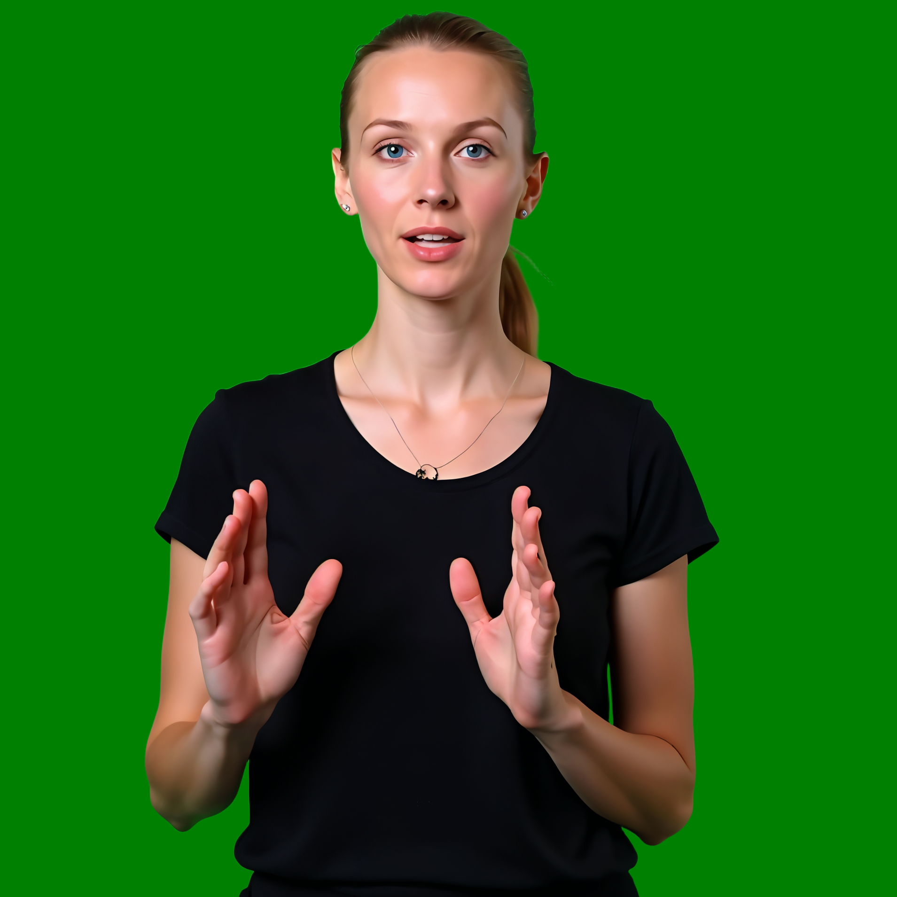

# Image to Human Avatar

This project aims to automatically process photos of humans into animatable human avatars.

Specifically, we aim to detect the human in the image, position it to our standard positioning, and mask it.

|                   Source Image                    |                            Area of Interest                            |                  Cropped                  |                  Masked                  |
|:-------------------------------------------------:|:----------------------------------------------------------------------:|:-----------------------------------------:|:----------------------------------------:|
| High quality image of a human. Shoulder width $x$ | Area of interest in $2.5x$ shoulder width where the center is the neck |           Image after cropping            |           Image after masking            |
|           |                                   |  |  |

## Real Examples

|                Source Image                 |                   Avatar                    |                Masked Avatar                |
|:-------------------------------------------:|:-------------------------------------------:|:-------------------------------------------:|
|  |  |  |
|   |   |   |
|   |   |   |

## Conditions

- Input can be of any aspect ratio.
- There must be a human in the image (real or fictional).
- The human must be standing, with their arms down, facing the camera (TODO).
- The image must be safe-for-work.
- The creator of the avatar must have the right to use the image.

## Usage

```bash
# cropping only (crop_image) — lightweight, no torch
pip install image-to-human-avatar

# full avatar pipeline (image_to_avatar): add the [mask] extra for background masking + pose
pip install "image-to-human-avatar[mask]"
```

To then process an image (requires the `[mask]` extra):
```python
from human_avatar.image_to_avatar import image_to_avatar
from PIL import Image

image = Image.open("example.jpg")
cropped, masked, pose = image_to_avatar(image)

masked.save("masked.png")
```

Pass `include_pose=False` to skip the full-body pose extraction (much faster).

To only crop a person out of an image of any size, without the avatar quality conditions:
```python
from human_avatar.image_to_avatar import crop_image
from PIL import Image

image = Image.open("example.jpg")
crop = crop_image(image, resolution=256)  # 256x256 shoulder-centered crop
```

### Web Server on Docker

```bash
docker build -t human-avatar .

docker run --rm -p 9874:8080 -e PORT=8080 \
  -v $(pwd)/output:/mnt/output \
  human-avatar

curl -X POST http://localhost:9874/ \
  -F "output=gs://output/flux" \
  -F "file=@assets/examples/flux/source.jpg"
```

Pass `-F "pose=false"` to skip writing the full-body `pose.pose` file (much faster).